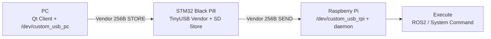

# 👋 안녕하세요! 임베디드 시스템 & IoT 개발자 **안창회**입니다.

**Firmware → Linux(Device/Driver) → Edge/Robot 시스템**까지  
임베디드와 Linux 기반 시스템을 연결하는 프로젝트를 진행해왔습니다.

---

## 🧑‍💻 About Me

- **임베디드 시스템 & IoT 개발자**
- **관심 키워드:** MCU Firmware · USB/Serial · Linux Driver · ROS2 · Edge AI · System Integration

---

## 🧩 Embedded Strength

- **Firmware**: 인터럽트 기반 이벤트 처리, 센서/모터 제어, 프로토콜 프레이밍(고정 프레임/검증)
- **Linux Interface**: `/dev/*` 기반 I/O 흐름 이해, 커널 드라이버 구조 학습 및 연동
- **Field-ready 통합**: 네트워크 불안정/현장 환경 고려한 자동 실행 + 복구(Recovery) 설계

---

## 🧰 기술 스택

  
  
  
  
  
  
  
  
  
  

---

## 🚀 Featured Project

### ☕ USB-MACRO — 원클릭 로봇 실행 Smart USB Bridge (Store & Forward + Recovery)
- **Repo:** https://github.com/won-jong-wan/USB-Macro  
- **한 줄:** PC에서 명령 패킷 “적재(Store)” → 로봇 연결 시 “자동 실행(Run)” + 네트워크 장애 시 “시리얼 복구(Recovery)”
- **Embedded Point**
  - **256Byte 고정 프레임** 프로토콜로 패킷 경계/검증/디버깅 용이
  - **USB Vendor + SD 저장** 기반 Store-and-Forward로 테스트 재현성 강화
  - **CDC↔UART Serial Console**로 SSH/네트워크 장애 상황에서도 현장 복구 가능
  - PC(Qt) / Linux 커널 드라이버(/dev) / RPi daemon까지 연결

---

## 🚀 주요 프로젝트

### 🧷 Linux Device Driver — 모듈 기반 시계 디바이스 드라이버
- **Repo:** https://github.com/ChangHoiAn/Project-DeviceDriver  
- **Embedded Point**
  - 커널/유저 영역 경계에서 디바이스 제어 흐름 설계 및 구현
  - 기능을 모듈로 분리해 드라이버 구조와 유지보수성 중심으로 정리

---

### 🤖 Raspberry Pi5 + Hailo 기반 AI 면접 시스템 (Edge AI)
- **Repo:** https://github.com/ChangHoiAn/Project-AI-Interview-system  
- **내용**
  - Raspberry Pi5 + Hailo 가속기로 정량적 AI 면접 구현
  - 웹캠으로 자세·표정 XML 저장
  - PC 클라이언트가 XML을 받아 LLM(Gemini) 분석 → 면접 점수 제공
  - 면접 시작/종료 명령 전송, 녹화 및 데이터 처리 자동화

---

### 🔐 IoT 기반 실시간 침입 감지 시스템 (MCU ↔ SBC ↔ DB ↔ 액추에이터)
- **Repo:** https://github.com/ChangHoiAn/Project-Instruction-Detection-system  
- **내용**
  - STM32 GPIO 인터럽트로 이벤트 감지
  - Wi-Fi로 Raspberry Pi → MySQL 저장
  - 침입 시 Bluetooth로 Arduino 제어 → 부저/LED/LCD

---

### ☀️ 태양광 추적 시스템 (센서 + 액추에이터 제어)
- **Repo:** https://github.com/ChangHoiAn/Project-Solar-Tracking-system  
- **내용**
  - STM32 기반 태양 위치 추적 → 효율적 에너지 수집
  - 서보 모터 제어 및 센서 데이터 처리

---

### ⚙️ 모터 제어 및 MATLAB Simulink 시뮬레이션 (센서리스 모터 제어)
- **Repo:** https://github.com/ChangHoiAn/Project-Motor-Control  
- **내용**
  - PMSM 모터 속도 제어 Simulink 구성 및 실행
  - C2000(TMS) MCU 기반 속도 제어 구현

---

## 🔮 앞으로 할 계획 (Next)

### 🎹 RTOS 기반 신디사이저 (STM32 Black Pill + FreeRTOS)
- **주제**
  - **RTOS 스케줄링** 기반으로 오디오 합성/입력/UI/출력을 태스크로 분리하고,
    **저지연·안정적인 오디오 파이프라인**을 구현하는 임베디드 신디사이저
- **구성 계획**
  - Task: **Audio Engine** (Oscillator/Wavetable + ADSR + Mixer)
  - Task: **I/O** (Encoder/Keypad 또는 MIDI(UART) 입력, 이벤트 큐)
  - Task: **Output** (I2S DAC 또는 PWM/DAC 출력, 버퍼 관리)
  - Task: **UI** (OLED 표시, Preset 관리)
- **예정 기능**
  - 파형(Sine/Saw/Square) + ADSR + 간단한 LPF/Delay
  - Preset 저장/로드, 실시간 파라미터 조정
  - (선택) MIDI 제어(UART) / 시리얼 커맨드 기반 제어

> Repo 링크는 생성 후 여기에 추가 예정

---

## 💡 관심 분야

**Embedded System | RTOS | Device Driver | USB/Serial | Motor Control | ROS2 | Linux Kernel | Edge AI**

---

## 📫 연락처
- **Email:** changhoian99@gmail.com

---

## ⭐ GitHub Stats

